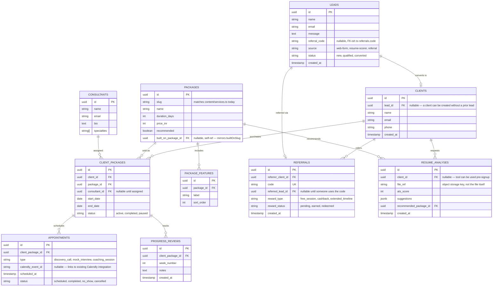

# Future Data Model — SaaS Direction

Per Mind Loop's reply (2026-08-17): the MVP itself needs no auth or
dashboards, but the architecture should be designed with the future SaaS
direction in mind (profiles, career tools, resume analysis, consultants
managing clients, client progress tracking, appointment management,
referrals). This doc is that sketch — **no code in this file is built yet**;
it exists so the current `content/*.ts` + Vercel-only MVP has a clear,
non-disruptive path to a real database and product surface later.

## Guiding principle

The MVP's `src/content/*.ts` files are already typed data shaped like what
the equivalent DB rows will look like (see README → Architecture). This
schema is that same shape, normalized into tables. Migrating means writing a
data-source adapter, not rewriting pages or components.

## Entities

## Mapping from today's MVP

| Today | Future |
|---|---|
| `src/content/services.ts` (`Service[]`, fields `name`, `duration`, `additions`, `builtOnSlug`, `priceINR`, `recommended`) | `packages` + `package_features` tables. `builtOnSlug` → `built_on_package_id` self-reference, same "everything in X, plus" logic. |
| `src/lib/validation.ts` `LeadFormInput` (`name`, `email`, `message`, `referralCode`) | `leads` table, 1:1 field match — the API route already validates against this exact shape, so swapping the `console.log` in `src/app/api/contact/route.ts` for a DB insert is the only change needed. |
| `LeadForm.tsx` referral code field | `referrals.code` lookup on submit — if the code matches an existing `referrals` row, set `leads.referral_code` and later `referrals.referred_lead_id` on conversion. Reward issuance (free session / cashback / extended timeline) is a manual or semi-automated step triggered when a `client_packages` row is created for the referred client — not built in the MVP. |
| `site.calendlyUrl` (single site-wide link) | Per-consultant Calendly link on the `consultants` row, so `/book-a-call` can eventually route to the assigned consultant instead of one shared calendar. |
| `/tools/resume-scorer` placeholder page | `resume_analyses` table + an upload endpoint. `recommended_package_id` is how a score routes a visitor toward a specific package, matching the "AI-generated suggestions → directed toward relevant services" requirement. |
| No auth | Route groups already isolate marketing pages from anything future (see README). A `/dashboard` (client: `client_packages`, `appointments`, `progress_reviews` for their own `client_id`) and a `/portal` (consultant: same tables scoped by `consultant_id`) can be added behind an auth provider (Clerk/NextAuth/Supabase Auth) without touching the marketing site's routes or components. |

## What's deliberately not built in this MVP round

- No real database — `content/*.ts` remains the data source.
- No auth, dashboards, or upload handling.
- No reward automation for referrals — the lead form only captures the code.
- No real resume parsing/scoring — `/tools/resume-scorer` is a placeholder
  page describing the intended flow.

This is scoped intentionally per Mind Loop's explicit "do not over-engineer"
instruction — the goal here is a schema that proves the current site's data
shapes already anticipate this, not a working backend.
