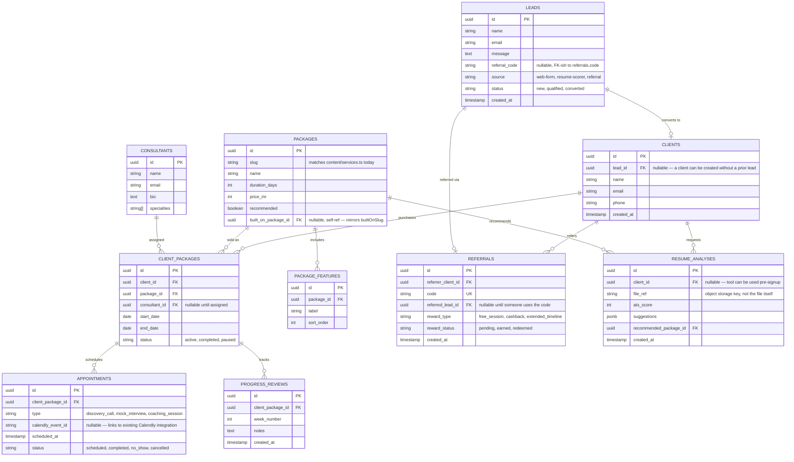

# Future Data Model — SaaS Direction

Per Mind Loop's reply (2026-08-17): the MVP itself needs no auth or
dashboards, but the architecture should be designed with the future SaaS
direction in mind (profiles, career tools, resume analysis, consultants
managing clients, client progress tracking, appointment management,
referrals). This doc was originally a sketch only; **as of 2026-08-18 it's
implemented as a working demo** (see "Demo implementation" below) so the
schema isn't just a diagram — it's a real, running SQLite database with
seed data and a page to inspect it live.

The public marketing site is unaffected: it still reads from `content/*.ts`
as before (see README → Architecture). This is an additive demo layer, not
a replacement — a deliberate scope call explained below.

## Demo implementation (2026-08-18)

- **Schema:** `prisma/schema.prisma` — every entity below, as real Prisma
  models, on SQLite (`DATABASE_URL="file:./dev.db"` in `.env.example`,
  zero external setup required).
- **Seed data:** `prisma/seed.mjs` — the 4 real packages (mirroring
  `src/content/services.ts`), a consultant, a lead converted to a client,
  a client package, two appointments, a progress review, a referral, and a
  resume analysis. Run `npm run db:seed` (or `npx prisma db seed`).
- **Live write path:** `/contact` → `POST /api/contact`
  (`src/app/api/contact/route.ts`) now writes a real `Lead` row (including
  `referralCode`) to this database, in addition to the existing console log.
  The DB write is wrapped in try/catch and never blocks the form — if the
  demo DB isn't set up, the contact form still works exactly as before.
- **See it live:** `/internal/demo` (`src/app/internal/demo/page.tsx`) — a
  read-only page rendering every table's current rows, including whatever
  you just submitted through `/contact`. Not linked from nav or footer,
  `robots: noindex`, no auth (this is a local/demo convenience, not a real
  admin panel — see "What this demo is not" below).
- **Setup:** `npx prisma migrate dev` then `npm run db:seed` (both already
  run once for this repo — `prisma/dev.db` is gitignored, so a fresh clone
  needs to redo both steps).

### What this demo is not

- Not production-ready as-is: SQLite's file-based storage doesn't survive
  Vercel's ephemeral serverless filesystem, so the live deployed site's
  `/contact` form will fail its (non-fatal, try/caught) DB write in
  production until this is pointed at a real hosted Postgres (Neon/Supabase
  free tier — a one-line `DATABASE_URL` and `provider` change, no schema
  changes). Locally (`npm run dev`) it works fully.
- No auth on `/internal/demo` — acceptable for a local demo, not for
  anything real. A production admin/portal view would sit behind the same
  future auth provider described in README → Architecture.
- No reward automation for referrals, no resume upload/scoring, no
  consultant-facing UI to create client packages or appointments — the demo
  proves the schema and the write path, not the full feature set. Building
  those is real, separate scope (see docs/next-steps.md).

## Guiding principle

The MVP's `src/content/*.ts` files are already typed data shaped like what
the equivalent DB rows will look like (see README → Architecture). This
schema is that same shape, normalized into tables. Migrating means writing a
data-source adapter, not rewriting pages or components.

## Entities

## Mapping from today's MVP

| Today | Future |
|---|---|
| `src/content/services.ts` (`Service[]`, fields `name`, `duration`, `additions`, `builtOnSlug`, `priceINR`, `recommended`) | `packages` + `package_features` tables. `builtOnSlug` → `built_on_package_id` self-reference, same "everything in X, plus" logic. |
| `src/lib/validation.ts` `LeadFormInput` (`name`, `email`, `message`, `referralCode`) | `leads` table, 1:1 field match — **done**: `src/app/api/contact/route.ts` now writes a `Lead` row alongside the existing console log. |
| `LeadForm.tsx` referral code field | `referrals.code` lookup on submit — if the code matches an existing `referrals` row, set `leads.referral_code` and later `referrals.referred_lead_id` on conversion. Reward issuance (free session / cashback / extended timeline) is a manual or semi-automated step triggered when a `client_packages` row is created for the referred client — not built in the MVP. |
| `site.calendlyUrl` (single site-wide link) | Per-consultant Calendly link on the `consultants` row, so `/book-a-call` can eventually route to the assigned consultant instead of one shared calendar. |
| `/tools/resume-scorer` placeholder page | `resume_analyses` table + an upload endpoint. `recommended_package_id` is how a score routes a visitor toward a specific package, matching the "AI-generated suggestions → directed toward relevant services" requirement. |
| No auth | Route groups already isolate marketing pages from anything future (see README). A `/dashboard` (client: `client_packages`, `appointments`, `progress_reviews` for their own `client_id`) and a `/portal` (consultant: same tables scoped by `consultant_id`) can be added behind an auth provider (Clerk/NextAuth/Supabase Auth) without touching the marketing site's routes or components. |

## What's still deliberately not built

- The public marketing site's content (`content/*.ts`) is still the source
  of truth for what visitors see — the database is a parallel demo layer,
  not wired into the live pages, so a package edit still means editing
  `services.ts` (see "Demo implementation" above for why).
- No auth, no real admin/dashboard UI — `/internal/demo` is read-only and
  unauthenticated, explicitly a demo convenience, not a portal.
- No reward automation for referrals — the lead form captures the code and
  it's stored on the `Lead` row; matching it to a `Referral` and issuing a
  reward is still a manual/future step.
- No real resume parsing/scoring — `/tools/resume-scorer` is still a
  placeholder page; `ResumeAnalysis` rows exist in the schema/seed data to
  prove the shape, not from a real upload flow.

This stays scoped per Mind Loop's explicit "do not over-engineer"
instruction — the demo proves the schema and the write path end to end, not
the full feature set on top of it.
